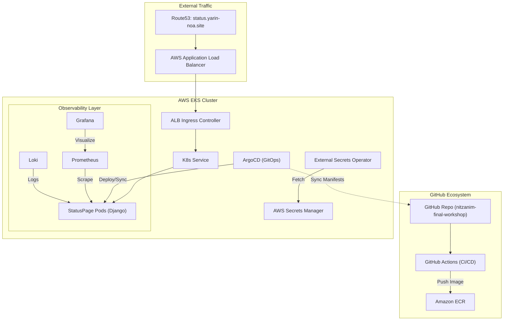

# 🟢 Nitzanim DevOps Workshop - Final Project

## 🏗️ Project Overview
This repository contains the complete infrastructure and application lifecycle for the **StatusPage** project, developed as part of the Nitzanim DevOps Bootcamp final workshop. The project demonstrates a production-ready DevOps pipeline, from Infrastructure as Code (IaC) to GitOps-based deployment and comprehensive observability.

**Developed by**: Yarin & Noa 🚀

---

## 🛠️ Technology Stack

| Layer | Technology |
| :--- | :--- |
| **Cloud Provider** | AWS (VPC, EKS, ECR, Route53, ACM) |
| **IaC** | Terraform |
| **Orchestration** | Kubernetes (EKS v1.35) |
| **GitOps** | ArgoCD |
| **CI/CD** | GitHub Actions |
| **Observability** | Prometheus, Grafana, Loki |
| **Secrets** | External Secrets Operator (ESO) |
| **Networking** | AWS ALB Ingress Controller, External-DNS |

---

## 📐 Architecture



---

## 🚀 Deployment Pipeline

### 1. Infrastructure (IaC)
The foundational infrastructure is managed via **Terraform**, located in the `/terraform` directory.
- **VPC**: Multi-AZ network with public and private subnets.
- **EKS**: Managed cluster with `t3.medium` node groups.
- **IAM**: Configured with IRSA (IAM Roles for Service Accounts) for secure access to AWS resources.
- **Bootstrap**: ArgoCD is automatically installed using the Helm provider.

### 2. CI/CD Flow
The application follows a standard CI/CD process:
1. **Developer Push**: Code changes are pushed to `main`.
2. **GH Actions**: Triggers a build-and-push workflow.
3. **Build**: Docker image is built using `BUILDKIT` for caching optimization.
4. **Push**: Image is pushed to **Amazon ECR** with the commit SHA and `latest` tags.
5. **Sync**: **ArgoCD** detects changes in the `/k8s` directory and automatically reconciles the cluster state.

### 3. Kubernetes Orchestration
Manifests are organized in the `/k8s` directory and managed by ArgoCD:
- **Deployments**: Django app and asynchronous workers.
- **Networking**: Ingress resources configured for AWS ALB with automated SSL/TLS termination via ACM.
- **ExternalDNS**: Automatically synchronizes ingress hosts with Route53.

---

## 📊 Observability & Monitoring
The cluster is equipped with a full monitoring stack installed via customized Helm charts:
- **Prometheus**: Metrics collection for cluster and application performance.
- **Grafana**: Pre-configured dashboards for easy visualization of system health.
- **Loki**: Centralized logging for real-time log exploration.
- **Access**: Easy access scripts available in `k8s/monitoring` and `k8s/logging`.

---

## 🔐 Security & Secrets
- **Secrets Management**: Sensitive data (DB credentials, API keys) are not stored in Git. Instead, they are managed by the **External Secrets Operator (ESO)**, which securely fetches them from **AWS Secrets Manager**.
- **Network Isolation**: Application nodes are located in private subnets, with only the Load Balancer exposed to the internet.

---

## 📂 Project Structure
```text
.
├── .github/workflows/   # CI/CD Workflows
├── k8s/                # Kubernetes Manifests (App, Monitoring, Logging)
├── status-page/        # Application Source Code & Dockerfile
├── terraform/          # Infrastructure as Code
└── eso.yaml            # External Secrets Configuration
```

---

## 📝 How to Use
1. **Initialize Infrastructure**:
   ```bash
   cd terraform
   terraform init
   terraform apply
   ```
2. **Access ArgoCD**:
   The `argocd.tf` script handles the installation. Access the UI to monitor the `status-page` application sync status.
3. **Monitoring**:
   Use the scripts in `k8s/monitoring/` to open Grafana and view pre-configured dashboards.

---
*Created for the Nitzanim Bootcamp Final Workshop - 2026*
